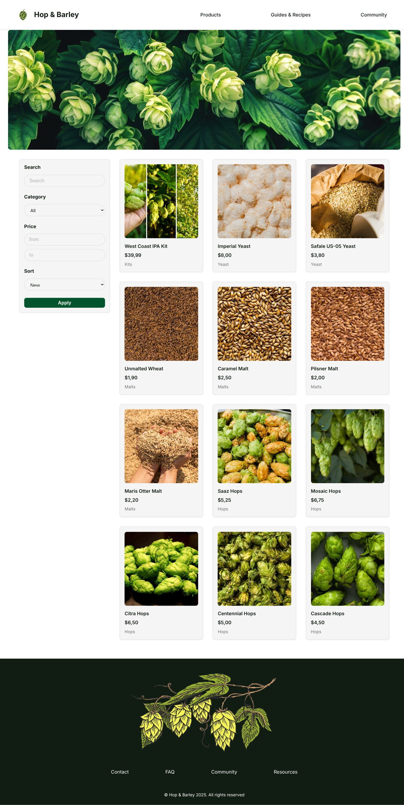
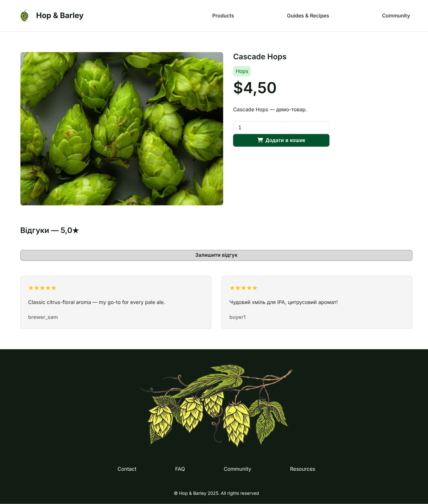
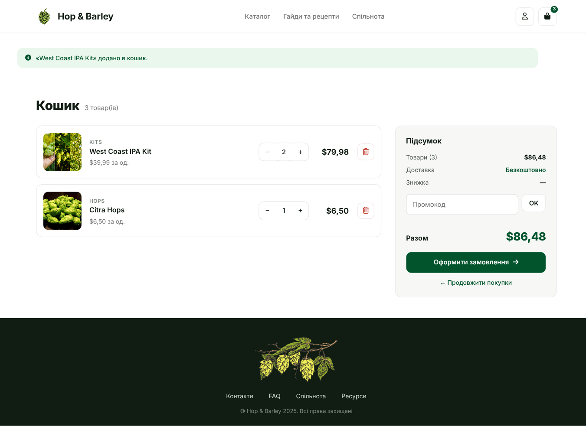
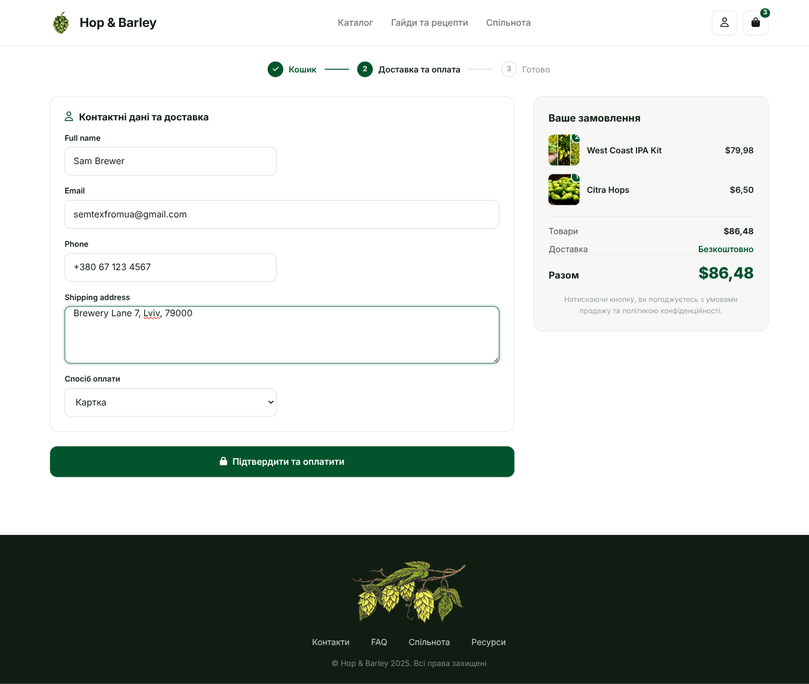
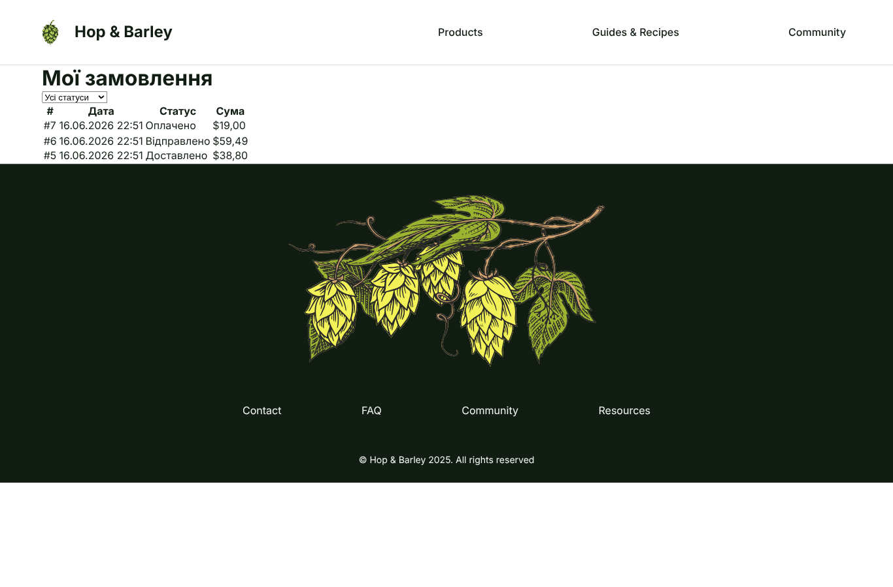
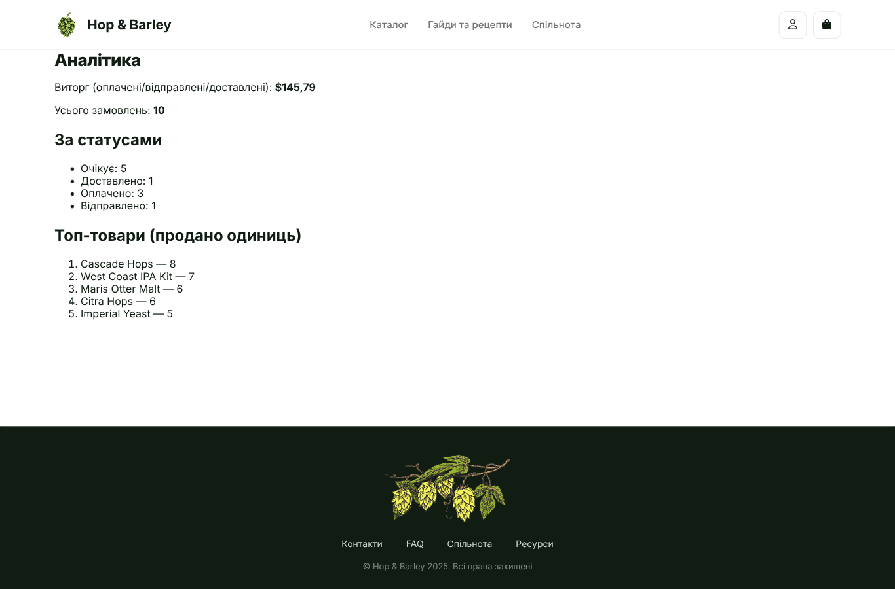
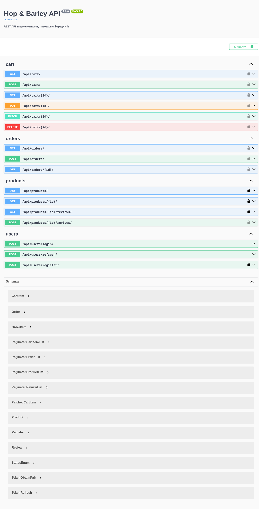
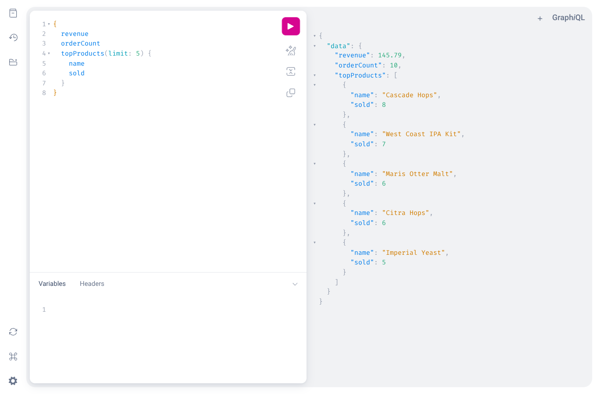

<div align="center">

# 🍺 Hop & Barley

**A full-stack e-commerce shop for home-brewing ingredients — Django web UI + DRF REST API + GraphQL analytics, on PostgreSQL & Docker.**

[](https://github.com/semtexfromua/django-test-shop/actions/workflows/ci.yml)


**English** · [Українська](README.uk.md)



</div>

---

## Table of Contents

- [Overview](#overview)
- [Features](#features)
- [Screenshots](#screenshots)
- [Tech Stack](#tech-stack)
- [Quick Start (Docker)](#quick-start-docker)
- [Local Development](#local-development)
- [REST API & JWT](#rest-api--jwt)
- [GraphQL (bonus)](#graphql-bonus)
- [Email notifications](#email-notifications)
- [Testing & Code Quality](#testing--code-quality)
- [Project Structure](#project-structure)
- [Implementation Checklist](#implementation-checklist)
- [License](#license)

## Overview

**Hop & Barley** turns a static HTML/CSS template into a working online store for beer-brewing
ingredients (hops, malts, yeast, kits). It is built as a learning project that demonstrates
idiomatic Django, Django REST Framework, relational data modeling, and production-minded
infrastructure.

Two entry points share one domain model:

- **Web storefront** — server-rendered Django templates with **session** auth and a **session cart**.
- **REST API** — DRF with **JWT** auth and a database-backed cart (`Cart`/`CartItem`), for external clients.

Business logic lives in thin views delegating to per-app `services.py`. Checkout runs inside a
`transaction.atomic` block with `select_for_update` row locks to prevent overselling, snapshots the
price into `OrderItem`, and emails the customer and admin on commit.

## Features

- **Catalog & search** — pagination, category & price-range filters, full-text-ish search by name/description, sorting by price / popularity / newest. Nested categories (`Ingredients → Hops/Malts/Yeast`).
- **Product page** — image, description, price, average rating, reviews; add-to-cart with quantity. Reviews can be left **only after purchase**, one per product per user.
- **Cart** — session-based; add / update / remove, live totals, **stock checks**.
- **Checkout** — contact + shipping form, mock payment, atomic order creation with **price snapshots**, **no overselling**, and **email notifications** to customer + admin.
- **Account** — registration, login/logout, **order history with status filter**, profile editing, password change. Email uniqueness enforced.
- **Admin & analytics** — Django admin for all models with search, filters and custom actions (mark shipped/delivered, cancel → restock); a staff analytics dashboard (revenue, order count, status breakdown, top products) built on ORM aggregations.
- **REST API** — products, cart, orders, reviews, registration; JWT access/refresh with **rotation + blacklist**; object-level ownership permissions; Swagger/OpenAPI docs.
- **GraphQL analytics (bonus)** — single `/graphql/` endpoint, staff-only resolvers; introspection disabled in production.
- **Quality** — type hints + docstrings (`mypy` clean), `ruff` lint, **95%+ test coverage** with `pytest`, Docker Compose, and GitHub Actions CI.

## Screenshots

### Storefront

| Catalog | Product & reviews |
|---|---|
| [](docs/screenshots/catalog.jpg) | [](docs/screenshots/product-detail.jpg) |

| Cart | Checkout | Order history |
|---|---|---|
| [](docs/screenshots/cart.png) | [](docs/screenshots/checkout.png) | [](docs/screenshots/order-history.png) |

### Admin & API

| Analytics dashboard | Swagger / OpenAPI | GraphiQL |
|---|---|---|
| [](docs/screenshots/analytics.png) | [](docs/screenshots/api-docs.png) | [](docs/screenshots/graphiql.png) |

## Tech Stack

| Area | Tools |
|---|---|
| Core | Django 5.2, Python 3.13 |
| API | Django REST Framework · SimpleJWT · drf-spectacular (OpenAPI) · django-filter |
| GraphQL | graphene-django |
| Database | PostgreSQL 16 (psycopg 3) |
| Infra | Docker & Docker Compose · Gunicorn · WhiteNoise |
| Tooling | uv (deps) · ruff (lint/isort) · mypy (+django-stubs) · pytest-django · factory-boy · pytest-cov |
| CI | GitHub Actions (ruff + mypy + pytest, Docker image build) |

## Quick Start (Docker)

> Requires Docker & Docker Compose. Brings up the app + PostgreSQL.

```bash
cp .env.example .env
docker compose up --build
```

| Page | URL |
|---|---|
| Storefront | http://localhost:8000/ |
| Admin | http://localhost:8000/admin/ |
| Swagger (REST) | http://localhost:8000/api/docs/ |
| GraphiQL | http://localhost:8000/graphql/ |

Seed demo data (catalog with images & nested categories), create an admin, set up the Managers role:

```bash
docker compose run --rm web python manage.py seed_catalog
docker compose run --rm web python manage.py createsuperuser
docker compose run --rm web python manage.py setup_roles   # "Managers" group
```

> **Note:** `docker-compose.yml` ships demo defaults (DB password, `SECRET_KEY`) for a one-command
> local run. For any real deployment, override `SECRET_KEY` and the DB credentials via environment,
> and enable the HTTPS flags (`SECURE_SSL_REDIRECT`, `SESSION_COOKIE_SECURE`, `SECURE_HSTS_SECONDS`).

## Local Development

```bash
uv sync                                   # install deps (incl. dev group)
docker compose up -d db                   # PostgreSQL on localhost:5433 (5432 is often taken)
uv run python manage.py migrate
uv run python manage.py seed_catalog
uv run python manage.py runserver         # http://127.0.0.1:8000/  (DEBUG=True)
```

## REST API & JWT

The API uses **JWT**: log in to get an `access` (30 min) and `refresh` (1 day) token; the refresh
token **rotates** on use and the old one is **blacklisted**. Send `Authorization: Bearer <access>`.

```bash
# 1) Register
curl -X POST localhost:8000/api/users/register/ \
  -H 'Content-Type: application/json' \
  -d '{"username":"alice","email":"alice@example.com","password":"Br3wMaster!99"}'

# 2) Log in → access / refresh tokens
curl -X POST localhost:8000/api/users/login/ \
  -H 'Content-Type: application/json' \
  -d '{"username":"alice","password":"Br3wMaster!99"}'
# → {"access":"<JWT>","refresh":"<JWT>"}

# 3) Catalog (public; filter / search / sort)
curl 'localhost:8000/api/products/?search=cascade&ordering=-sold'

# 4) Add to cart, then place an order (authenticated)
curl -X POST localhost:8000/api/cart/ \
  -H 'Authorization: Bearer <access>' -H 'Content-Type: application/json' \
  -d '{"product":1,"quantity":2}'
curl -X POST localhost:8000/api/orders/ \
  -H 'Authorization: Bearer <access>' -H 'Content-Type: application/json' \
  -d '{"full_name":"Alice","email":"alice@example.com","phone":"+380...","shipping_address":"...","method":"card"}'

# 5) Refresh the access token
curl -X POST localhost:8000/api/users/refresh/ \
  -H 'Content-Type: application/json' -d '{"refresh":"<refresh>"}'
```

| Resource | Method | Endpoint |
|---|---|---|
| Products | `GET` | `/api/products/`, `/api/products/{id}/` |
| Reviews | `GET` `POST` | `/api/products/{id}/reviews/` |
| Cart | `GET` `POST` `PATCH` `DELETE` | `/api/cart/`, `/api/cart/{id}/` |
| Orders | `GET` `POST` | `/api/orders/`, `/api/orders/{id}/` (own only) |
| Register | `POST` | `/api/users/register/` |
| Login / Refresh | `POST` | `/api/users/login/`, `/api/users/refresh/` |
| Docs | `GET` | `/api/docs/` (Swagger), `/api/schema/` (OpenAPI 3) |

Permissions are object-level: a user only ever sees and modifies their own cart and orders.
Full request/response schemas live in **Swagger** at `/api/docs/`.

## GraphQL (bonus)

Single endpoint `POST /graphql/` (GraphiQL UI in dev). Analytics resolvers are **staff-only**:

```graphql
{
  revenue
  orderCount
  topProducts(limit: 5) { name sold }
}
```

## Email notifications

On checkout (after the DB transaction commits) the shop sends two **HTML emails**
(with a plain-text fallback, rendered from `templates/emails/`): an order
confirmation to the customer and a "new order" notification to the site admins
(`ADMINS`). The default backend is **console** (emails print to the log).
To deliver real email, set the SMTP backend and credentials via env — e.g. the
**Mailtrap** sandbox, which captures mail in a web inbox (safe, no real-spam risk):

```bash
EMAIL_BACKEND=django.core.mail.backends.smtp.EmailBackend
EMAIL_HOST=sandbox.smtp.mailtrap.io
EMAIL_PORT=2525
EMAIL_HOST_USER=<your-mailtrap-user>
EMAIL_HOST_PASSWORD=<your-mailtrap-password>
EMAIL_USE_TLS=True
```

### Reliable delivery (Celery)

Order emails are sent **asynchronously** through a Celery task (Redis broker), which is
what makes a core feature reliable: checkout never blocks on SMTP, and transient failures
(e.g. a provider rate-limit) **auto-retry** with backoff instead of being silently dropped.
Staff can re-send an order's emails from the admin (Orders → action «Надіслати листи ще раз»).

Run locally: `docker compose up -d db redis`, then `uv run celery -A config worker -l info`
alongside `uv run python manage.py runserver` (or `docker compose up` for the full stack).
Tests run tasks inline (`CELERY_TASK_ALWAYS_EAGER`), so no broker is needed in CI.

A dedicated email-event table or a Flower dashboard would be **overkill** for this feature —
Celery's retry plus the admin resend already cover reliable delivery.

## Testing & Code Quality

```bash
uv run pytest          # tests + coverage gate (fail under 80%); currently ~95%
uv run ruff check .    # lint + import sorting
uv run mypy .          # static type checking
```

CI (GitHub Actions) runs all three on every push to `main`/`develop` and on PRs, plus a Docker
image build.

## Project Structure

```
config/      settings (base/dev/prod), root urls, wsgi/asgi
users/       custom User, auth, account (session-based)
products/    Category, Product, catalog views, seed_catalog command
reviews/     reviews (purchase-gated, one per product/user)
orders/      session cart + Cart/CartItem (API), checkout, services, analytics, admin actions
payments/    mock payment service
api/         DRF: serializers, viewsets, JWT, OpenAPI
gql/         GraphQL schema & resolvers (analytics)
templates/   Django templates (Hop & Barley design)
static/      CSS, images, icons
docs/        spec, design docs, audit log, screenshots
```

Dependencies are acyclic: `users, products → orders → payments`; `reviews → products, orders`;
`api, gql → all`. Business logic sits in `<app>/services.py`; views stay thin.

## Implementation Checklist

- [x] `docker compose up` brings up the full stack on PostgreSQL
- [x] Catalog: filters, search, pagination, sorting (incl. popularity)
- [x] Product page: details, reviews, add-to-cart
- [x] Cart: manage contents, totals, stock checks
- [x] Checkout: order creation, email notifications, validation, atomic + price snapshot
- [x] Account: registration, login, order history (with status filter), profile, password change
- [x] REST API: JWT (access/refresh + rotation/blacklist), object-level permissions, Swagger
- [x] Admin: analytics, filters, custom actions, role setup
- [x] Type hints + docstrings · `ruff`/`mypy` clean · tests (coverage ≥ 80%, ~95%)
- [x] Meaningful commits · `feature/* → develop → main` branching
- [x] **Bonus:** GraphQL analytics · GitHub Actions CI · `uv` dependency manager

## License

Educational project — no specific license. The Hop & Barley HTML/CSS design originates from
[MagicCodeGit/Hop-and-Barley](https://github.com/MagicCodeGit/Hop-and-Barley).
